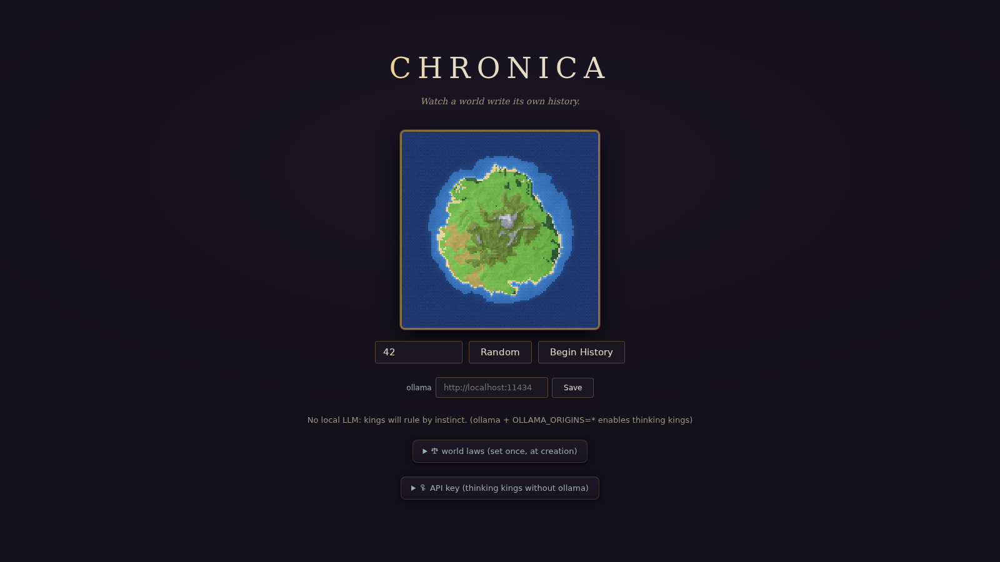
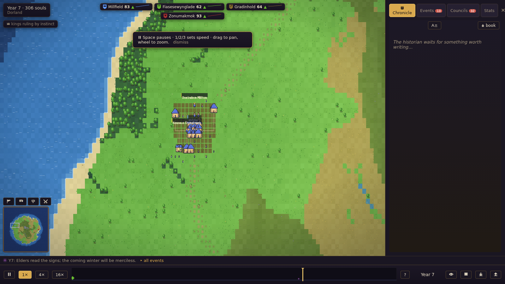
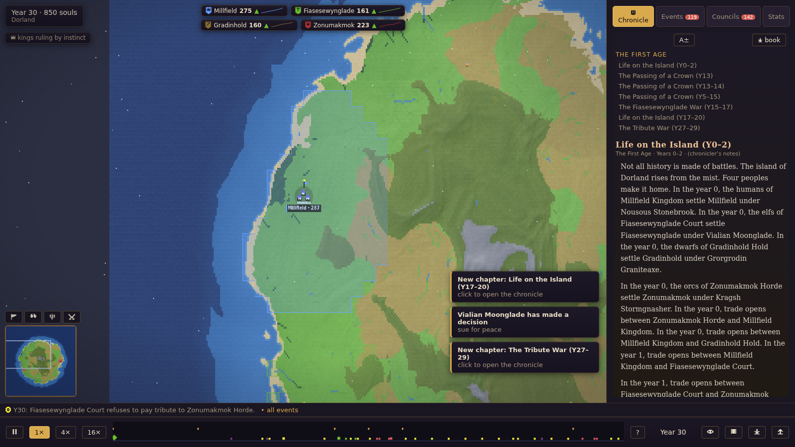
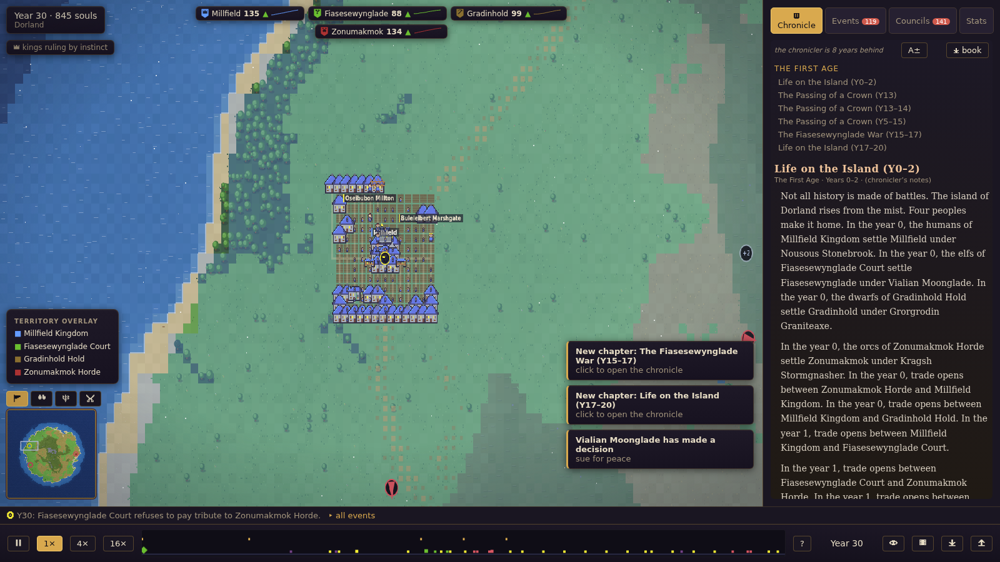
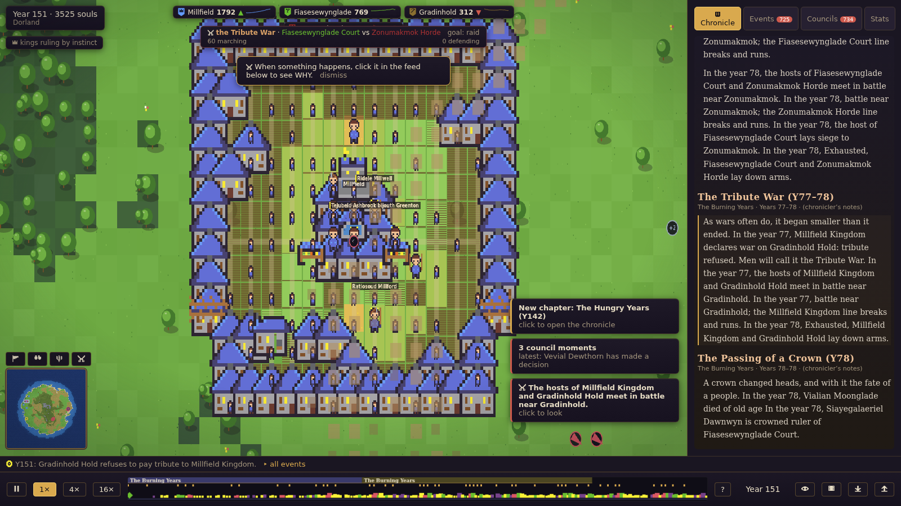

# Chronica

A world simulator that thinks. Procedurally generated island. Autonomous factions of humans, elves, dwarves, and orcs who farm, build, trade, scheme, and wage war over 500 years. Their leaders use an LLM to make strategic decisions: wars have motives you can read, not dice rolls. A living chronicle writes the island's history as it unfolds. The time machine lets you click any paragraph and travel back to watch it happen.

The player reads and rewinds; there is no direct control.

## Key systems

Three headline features that together form the core loop:

- **Thinking kings.** Faction leaders make strategic decisions via a local LLM (ollama) or bring-your-own-key API. Their in-character reasoning is visible in the council panel: every war declaration cites a grudge, every alliance has a rationale. When no LLM is available, a rule-based strategist (RuleBrain) fills the same role through the same interface; the sim runs identically either way.
- **Living chronicle.** An LLM historian clusters the event causality graph into narrative chapters and writes the island's history as it unfolds. Every fact is validated against the event log; invented names or years are rejected and fall back to template prose.
- **Time machine.** The simulation is strictly deterministic. `history = f(seed, decision journal)`. Scrub the timeline to any year. Click a chronicle paragraph to jump the camera to that year and place. Replays are bit-identical and make zero LLM calls.

### The world
- **Terrain that reads like a map:** procedural island with hillshade relief, biome-specific forests and pines, animated coastal waves and shore foam, rivers, drifting cloud shadows, and a soft vignette. A curated pixel-art palette keeps every zoom level legible.
- **Civilizations that visibly advance:** multi-tile buildings in four race architecture styles with kingdom-colored roofs. Towns grow from timber hamlets into walled stone cities: streets, plazas, wells, market stalls, statues, fountains, and capital keeps appear as population and prosperity rise. Crop fields till, sprout, and ripen gold with the seasons. Caravans wear visible trade roads between settlements.
- **A living population:** animated pixel pawns with race-distinct silhouettes that walk, farm, mine, and fight. Kings and heroes carry name banners on the map. At strategic zoom, idle townsfolk fold into plaza crowds so that anything crossing the open map is story: armies, caravans, monsters, protagonists.

### War and drama
- **Battles you can watch:** engagements render as fighting soldiers with weapon flashes, arrow arcs, and the fallen; sieges pitch tent encampments; marching armies trace intent trails toward their objectives; a war strip announces every front.
- **History leaves marks:** razed towns burn with flames and glowing embers before collapsing into rubble; battlefields keep blood and scorch decals; festivals scatter confetti. All of it is derived from the event log, so time-machine scrubs replay it exactly.
- **Spectacle engine:** zoom-scaled scenes for coronations, dragon raids, plagues, rebellions, foundings, famines, festivals, and era turns, complete with letterbox title cards.
- **Monsters:** dragons, trolls, and wolf packs roam as animated multi-tile creatures with ground shadows.

### Reading the world
- **Far-zoom map mode:** the island becomes a painted map with faction-tinted territory, chunky borders that pulse red in wartime, heraldic settlement icons, and army banners.
- **Pixel-consistent UI:** a parchment-and-bronze interface with a hand-drawn pixel icon set (no OS emoji), faction banner sigils, an era-labeled timeline, per-faction population sparklines, data overlays (territory, population, food, war), and a global search.
- **Dials and records:** character sheets with three-generation lineage, star/follow camera, world records, genesis-time world laws (aggression, fertility, lifespan, disasters), and a 200-year timelapse export.

## Screenshots

| Landing & worldgen preview                     | A town at year 5                              |
| ---------------------------------------------- | --------------------------------------------- |
|  |     |

| Chronicle open over the world                       | Territory overlay                                     |
| --------------------------------------------------- | ----------------------------------------------------- |
|  |  |

| Far-zoom map mode                              | The same capital, 150 years on                              |
| ---------------------------------------------- | ----------------------------------------------------------- |
|  |    |

## Quick start

```bash
npm install
npm run dev           # http://localhost:5173
npm test              # determinism suite + golden seeds + edge cases
npm run build         # static bundle in dist/
```

**Performance benchmark:**

```bash
node scripts/perf.mjs [years] [mapSize]
```

**LLM evaluation harness:**

```bash
node scripts/eval-llm.mjs   # needs local ollama
```

### LLM setup (optional)

The sim runs fully without an LLM (RuleBrain fallback). To enable thinking kings and the living chronicle:

1. Install [ollama](https://ollama.com)
2. Pull a 4B+ instruction model: `ollama pull gemma4:12b`
3. Serve with: `OLLAMA_ORIGINS="*" ollama serve`
4. Chronica detects it automatically on page load

Alternatively, use a BYO API key (OpenRouter or Anthropic) via the in-app prompt. The key is stored in localStorage only; the app never sends it to any server.

## Controls

| Input                | Action                                 |
| -------------------- | -------------------------------------- |
| Space                | Pause / resume                         |
| 1 / 2 / 3            | Speed 1× / 4× / 16×                 |
| Drag / WASD / Arrows | Pan camera                             |
| Scroll wheel         | Zoom to cursor                         |
| `+` / `-`        | Zoom in / out                          |
| Click pawn           | Open inspector                         |
| Click event          | Show causality chain                   |
| C / E                | Open Chronicle / Events panel          |
| `/`                | Global search                          |
| T / P / F / Shift+W  | Overlays: territory / pop / food / war |
| H                    | Postcard mode                          |
| G                    | Screenshot                             |
| `,` / `.`        | Step season / year (while paused)      |
| Escape               | Close all panels                       |

## Repository structure

```
chronica/
  index.html          Entry point, landing overlay
  package.json        Vite + TypeScript + Vitest
  tsconfig.json       Strict TypeScript config
  src/
    main.ts           App entry, worker boot, render loop, input, panels
    simWorker.ts      Web Worker entry
    sim/              Pure deterministic core (no I/O, no render imports)
    render/           Canvas2D renderer, camera, sprites, terrain, effects
    ui/               DOM panels, theme.css, pixel icon set, stats charts, beacons
    brain/            LLM adapters (ollama, BYO key, RuleBrain) + priority queue
    chronicle/        Chapter detector, validator, template fallback
    shared/           Types, serialization, save store
  test/               16 test files: determinism, worldgen, economy, war, LLM, soak, etc.
  scripts/
    lint-sim.mjs      Enforces sim import boundaries
    visual.mjs        Playwright screenshot matrix for visual QA
    eval-llm.mjs      LLM decision-quality harness
    perf.mjs          Headless throughput benchmark
  docs/               Design documents (00-vision through 14-visual-overhaul-v3)
  docs/screenshots/   Screenshot matrix captured by scripts/visual.mjs
```

## High-level architecture

The app is a single-page TypeScript application with zero backend dependencies. The sim runs in a Web Worker (transferable ArrayBuffers). The render thread receives snapshots at 60 fps. UI panels are vanilla DOM.

```
┌───────────────────────────────────────────────────────────┐
│  Main thread                                              │
│  ┌──────────┐  ┌────────┐  ┌──────────────┐  ┌────────┐  │
│  │  Render  │  │   UI   │  │  LLM Brain   │  │  Save  │  │
│  │ (Canvas) │  │(Panels)│  │ (ollama/BYO) │  │ (IDB)  │  │
│  └────┬─────┘  └────┬───┘  └──────┬───────┘  └───┬────┘  │
│       └─────────────┼─────────────┼──────────────┘       │
│                     │  snapshots  │ decisions             │
└─────────────────────┼─────────────┼───────────────────────┘
                      │             │
┌─────────────────────┼─────────────┼───────────────────────┐
│  Web Worker         ▼             │                       │
│  ┌─────────────────────────────────────────────────────┐  │
│  │  Sim core (pure deterministic, no I/O)              │  │
│  │                                                     │  │
│  │  Every tick: run systems in fixed order             │  │
│  │  → when a king needs a decision: emit a request     │  │
│  │    to the main thread, continue without blocking     │  │
│  │  → when a decision arrives (journaled): apply       │  │
│  │    at the scheduled tick via brainInboxSystem       │  │
│  │                                                     │  │
│  │  state = f(seed, decision journal)                  │  │
│  └─────────────────────────────────────────────────────┘  │
└───────────────────────────────────────────────────────────┘
```

**Why this matters for the LLM:** The sim never calls an LLM inline. When a king needs to decide, the sim emits a `DecisionRequest` (with a situation digest) and keeps ticking. The main thread's brain adapter (ollama, BYO key, or RuleBrain) processes it asynchronously. The result is appended to the journal and applied at a future tick. During replay, the journal supplies the same decisions directly: no LLM calls, bit-identical history. This decoupling means the sim is never blocked on inference, and the full determinism guarantee is preserved.

**Deployment:** static bundle (Vite build) deployable anywhere: Cloudflare Pages, Vercel, Netlify, GitHub Pages. No server, no database. Saves via IndexedDB + journal export as JSON (~1 MB for 500 years).
